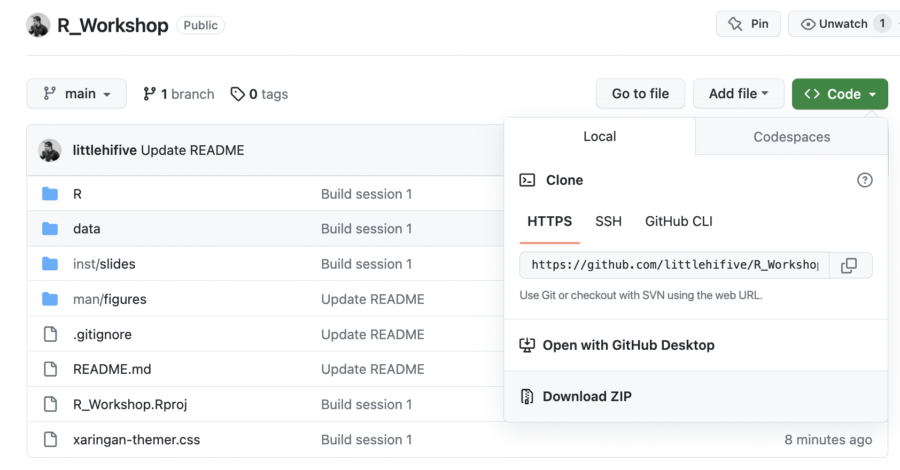

<!-- README.md is generated from README.Rmd. Please edit that file -->

# Youth Impact R Workshops

<!-- badges: start -->
<!-- badges: end -->

Welcome! If you want to learn R or use
the tools in our data pipeline, you’ve come to the right place. Over
time we’ll add more and more tutorials to cover a breadth of topics so
that you can explore the R ecosystem and see how it could benefit your
workflow.

## Recommended Learning Materials

[*R for Data Science*](https://r4ds.had.co.nz/) by Grolemund and Wickham.

# Workshop Recordings

...

# Setup

There are a couple steps to take to get ready:

## 1 - Get Materials

All materials for the workshops are contained in this repository. You’ll
need to download this repo to get started. There are a couple methods
you can use.

### ZIP Download

Github provides downloadable ZIP archives of entire repositories for
ease of use. Use the “Download ZIP” menu item via the “Code” button
shown below:



Extract the ZIP in a folder you remember, and you’ll be all set.

### Git-based

We’ll have a git & Github tutorial soon, but for now we’ll cover the
basics just to get you started:

1.  Install [Github Desktop](https://desktop.github.com/). This
    application takes care of most git workflow tasks.
2.  Once installed, open Github Desktop, navigate to the menu, and
    select `File > Clone Repository...`.
3.  In the dialog box that pops up, select the "URL"" tab, and put
    “littlehifive/R_Workshop” into the “Repository URL or
    GitHub username and repository” field. Choose whichever local path
    that you want.
4.  You can also navigate to the workshop repository, click Code, and click Open with Github Desktop.

## 2 - Get Set Up

At this point, you should have downloaded this repository. Now we need
to set up this repository:

1.  Download and install [R](https://cran.r-project.org/) *and*
    [RStudio](https://rstudio.com/). Note: R and RStudio are *not* the
    same thing. R is the language and execution environment, and RStudio
    is an integrated development environment (IDE) *for* R. In other
    words, you write code using RStudio, and then you run your code
    in R.
2.  Navigate to where you downloaded this repository, and open
    `R_Workshop.Rproj` with RStudio (double-clicking the file should do).
3.  In the "Console" tab that should appear in the left pane, run these
    two commands in order:

``` r
install.packages("devtools")
devtools::install_deps(dependencies = TRUE)
```

All of the packages that all materials depend upon should now be
installed.
